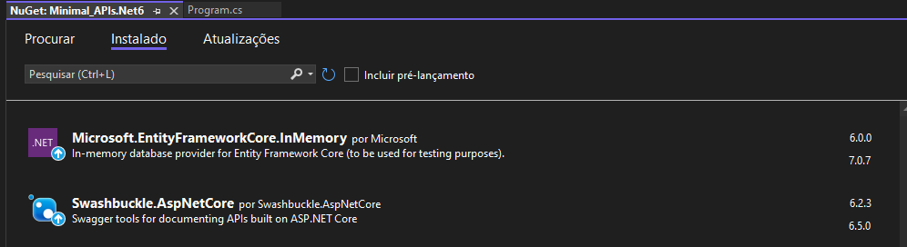
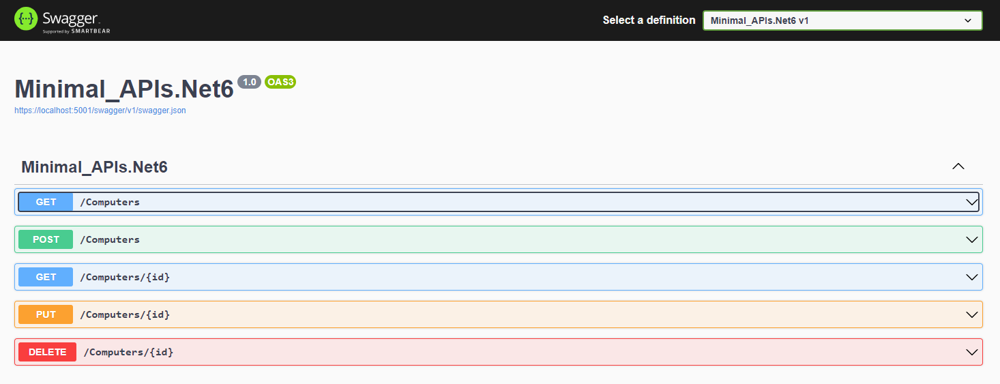
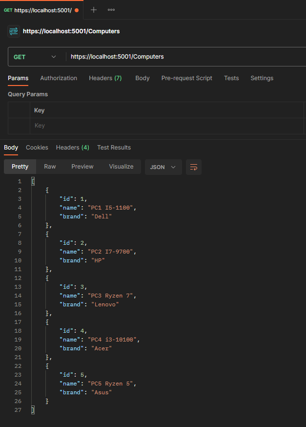

# Minimal API - .Net 6

Bem-vindo ao Projeto de Minimals apis! 

Neste arquivo README, você encontrará informações úteis sobre o funcionamento do projeto.

## Índice

- [Sobre](#sobre)
- [Tecnologias e Frameworks](#tecnologias-e-frameworks)
- [Em funcionamento](#em-funcionamento)
- [Conclusão](#conclusão)

## Sobre

Com o lançamento do .NET 6, a Microsoft apresentou as Minimal APIs, que foram desenvolvidas com o objetivo de simplificar a criação de APIs HTTP com menor consumo de recursos. 
Essa abordagem se mostra altamente eficiente na implementação de microsserviços e aplicativos que visam reduzir as dependências do ASP .NET Core.

O projeto consiste em uma API que faz conexão com um banco de dados InMemory do Entity Framework. 
Essa API permite, por meio de suas requisições, realizar operações de cadastro, criação, listagem e exclusão de computadores.

## Tecnologias e Frameworks 

Neste projeto, foi utilizado as seguintes tecnologias:

- C# 
- ASP.NET Core
- .NET 6
- HTML
- Swagger
- Entity Framework

## Em funcionamento

1. Clone este repositório: `git clone https://github.com/M-LaScala/Minimal_APIs.Net6`
2. Navegue até o diretório do projeto e abra o arquivo .SLN com o visual studio 2022+
3. Instale os pacote NuGet dependentes

Swashbuckle.AspNetCore.Swagger é uma biblioteca na qual fornece suporte para geração de documentação interativa da API em aplicativos ASP.NET Core usando o Swagger.
Microsoft.EntityFrameworkCore.InMemory fornece suporte para o Entity Framework Core criar um banco de dados em memória durante a execução de um aplicativo.

Aqui estão disponíveis os endpoints exibidos no Swagger. Além disso, você encontrará informações detalhadas sobre cada endpoint, incluindo os métodos HTTP suportados, os parâmetros necessários, as respostas esperadas e as possíveis opções de autenticação.

Aqui está um exemplo de requisição GET que pode ser realizada através da ferramenta Postman. Esse exemplo demonstra como fazer uma requisição GET para obter todos dados de um determinado endpoint da API.

## Conclusão

Este projeto foi iniciado no ano de 2021, com o intuito de servir como um estudo prático para a criação de Minimal APIs com .NET. O objetivo principal é explorar e compreender os conceitos e práticas relacionadas à construção de APIs simplificadas e de alto desempenho utilizando a plataforma .NET.

